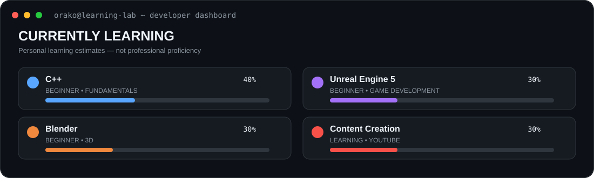

<div align="center">

# ORAKO GAMEZ

**Beginner Developer · C++ Learner · Game Development · Content Creator**

Learning by building small things, experimenting, and improving one project at a time.

</div>

<p align="center">
  
</p>

## 🖥️ `orako@learning-lab`

<p align="center">
  
</p>

## 🚀 Currently Learning

<table>
<tr>
<td align="center" width="50%">
<br><br>
<b>C++</b><br>
<sub>Beginner · Programming fundamentals</sub>
</td>
<td align="center" width="50%">
<br><br>
<b>Unreal Engine 5</b><br>
<sub>Beginner · Game development</sub>
</td>
</tr>
<tr>
<td align="center">
<br><br>
<b>Blender</b><br>
<sub>Beginner · 3D and visual work</sub>
</td>
<td align="center">
<br><br>
<b>Content Creation</b><br>
<sub>Learning · YouTube</sub>
</td>
</tr>
</table>

<details>
<summary>🎯 Learning Progress</summary>

> These are personal estimates of where I am in my learning journey — not measures of professional ability.

| Skill | Level | Progress |
|---|---|---|
| C++ | 🟢 Beginner | `████░░░░░░ 40%` |
| Git & GitHub | 🟢 Beginner | `████░░░░░░ 40%` |
| Unreal Engine 5 | 🟢 Beginner | `███░░░░░░░ 30%` |
| Blender | 🟢 Beginner | `███░░░░░░░ 30%` |
| Game Development | 🟢 Beginner | `███░░░░░░░ 30%` |
| Content Creation | 🟡 Learning | `███░░░░░░░ 30%` |

</details>

## 🛠️ What I'm Working On

<table>
<tr><td>🎮</td><td>Learning C++ for game development</td></tr>
<tr><td>🧩</td><td>Learning Unreal Engine 5</td></tr>
<tr><td>🎨</td><td>Learning Blender and 3D</td></tr>
<tr><td>💻</td><td>Building small programming projects</td></tr>
<tr><td>📺</td><td>Learning YouTube and content creation</td></tr>
</table>

## 🎮 Learning Quest

<table>
<tr>
<td width="25%" align="center">🟢<br><b>Fundamentals</b><br><sub>Learning</sub></td>
<td width="25%" align="center">🟡<br><b>C++</b><br><sub>In Progress</sub></td>
<td width="25%" align="center">⚪<br><b>Game Dev</b><br><sub>Next</sub></td>
<td width="25%" align="center">⚪<br><b>Projects</b><br><sub>Next</sub></td>
</tr>
</table>

```text
Programming Fundamentals
          ↓
         C++
          ↓
  Game Development
          ↓
  Unreal Engine 5
          ↓
    Blender / 3D
          ↓
  Build Games & Projects
          ↓
    Share & Improve
```

## ⭐ Projects & Milestones

### 🎨 Blender Projects

My Blender practice repository, where I'm learning 3D and experimenting with visual effects.

`Blender` · 🟡 Learning / Building

The repository is currently private, so it isn't linked as a public portfolio project yet.

### 🏆 First Blender VFX Project

**Milestone unlocked:** started my first Blender VFX project and began documenting my work through Git.

## 📈 My Coding Journey

> Every project is another step forward.

As I learn, my repositories and contribution history will grow with me.

## 🔨 Current Status

| Area | Status |
|---|---|
| 💻 C++ | 🟢 Learning |
| 🎮 Unreal Engine 5 | 🟡 Learning |
| 🎨 Blender | 🟡 Learning |
| 🧪 Projects | 🟡 Building |
| 📺 YouTube | 🔵 Growing |

## 🌐 Connect

<p>
  <a href="https://github.com/OrakoGamez">
    
  </a>
</p>

---

<p align="center">
  <sub>Learning · Building · Improving</sub>
</p>
